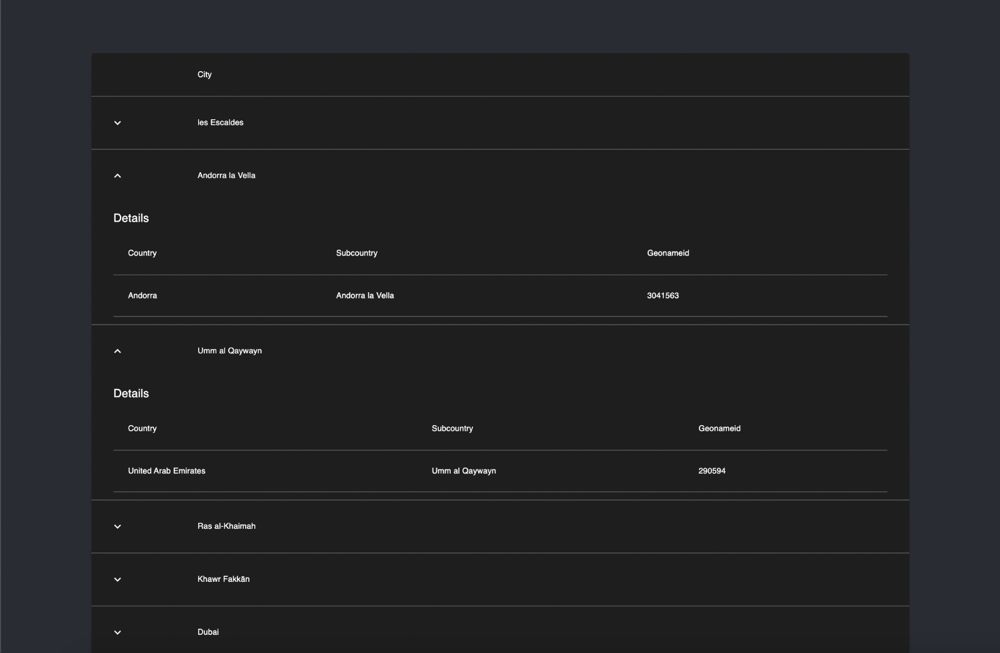
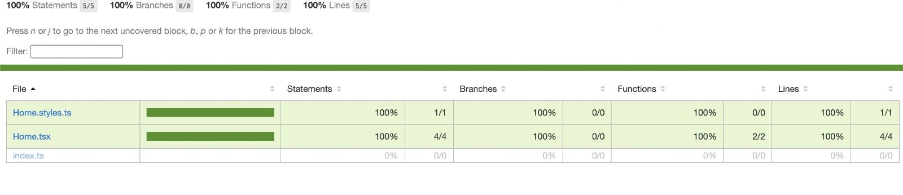

# Technical Test

## Summary

This project is a table viewer with childrens

## Preview

## How to

- Run development

-- yarn start 

- Run Production

-- yarn build 

- Testing

yarn test:coverage

### Test options

yarn test - just run test with coverage console

yarn test:update - update snapshots

yarn test:coverage - run test and generate the file aboce on coverage folder

# Tools

- React
- Typescript
- Jest
- Webpack 5
- Babel
- React Testing Library
- Styled Components
- Material UI - MUI
- MirageJS - Mock Server
- React Query - Caching and Fetch State Management
- Axios - Fetch Library

# Task requirements

As a react developer, you should implement an autocomplete component of cities.

Use any UI libraries such as bootstrap/material etc.
Showing selected city data on table (country, subcountry & geonameid)
The component should be written using React.Js
The server-side should be written as API                                                            
Bonus - add meaningful unit tests for your work For your convenience we have attached a sample CSV file with cities. (You do not have to use the entire file)